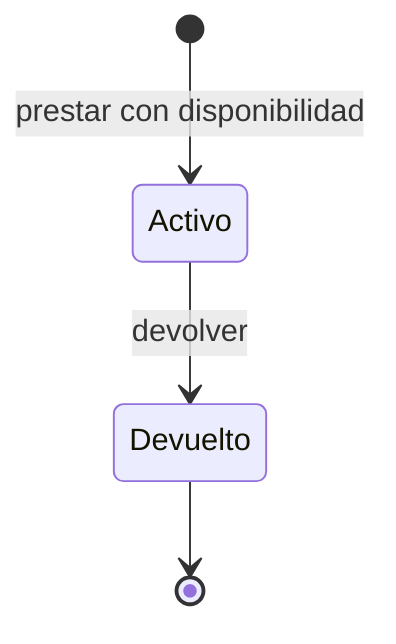

# Modelamiento de datos, estados y comportamiento

[Recurso anterior](../../unidad-1/06-agilidad-y-entregas/README.md) · [Índice de la unidad](../README.md) · [Siguiente recurso](../../unidad-1/08-dominios-de-aplicacion/README.md)

## Objetivo

Crear modelos consistentes con requisitos y criterios de aceptación.

## Conceptos y explicación

Un modelo abstrae aspectos relevantes de una realidad y omite detalles para responder una pregunta. Un modelo de contexto identifica actores e intercambios; uno de datos explica entidades y atributos; uno de estados describe cambios permitidos. Un diagrama debe aclarar su propósito, no acumular símbolos.

Una entidad tiene identidad y datos. Un kit puede tener código y unidades; un préstamo relaciona un kit y un solicitante ficticio. Mezclar ambos en una sola cantidad pierde el historial. El estado disponible puede derivarse de datos, mientras que activo/devuelto describe el préstamo. Una transición requiere evento y condición.

UML proporciona notaciones de modelado, pero no todo dibujo es UML. Los diagramas Mermaid de este curso representan relaciones y flujos con una notación accesible. Deben coincidir con tablas, reglas y ejemplos. Un modelo es revisable: si una devolución parcial es necesaria, el modelo simple activo/devuelto puede requerir ampliación.

## Caso resuelto paso a paso

Modelo inicial: cada préstamo entrega una unidad y permite una devolución completa.

| Dato | Regla |
|---|---|
| Código del kit | Identifica un kit existente |
| Identificador del préstamo | No se repite |
| Estado | Activo o devuelto |

No se permite devolver dos veces: aumentaría indebidamente la disponibilidad. El modelo es válido solo bajo la regla de una unidad por préstamo.

## Práctica guiada

Declara qué pregunta responde el modelo. Enumera estados y eventos. Escribe condiciones de cada transición. Prueba un evento permitido y uno inválido. Ajusta el modelo si cambias una regla de negocio.

## Errores que conviene detectar

- Dibujar una transición sin definir su evento y su condición.
- Permitir doble devolución y aumentar stock dos veces.

## Ejercicio para resolver

Modela una reserva con estados pendiente, confirmada y cancelada. Indica si una cancelada puede volver a confirmarse y qué implica tu decisión.

Solución y razonamiento (abre después de intentarlo)

Una opción válida es pendiente → confirmada o cancelada; confirmada → cancelada; cancelada es terminal. Volver a reservar crea una nueva reserva, preservando historia. Si se permite reactivar, hay que comprobar cupos nuevamente y registrar la transición.

## Preguntas de comprensión

¿Qué detalle conviene omitir del modelo? ¿Una flecha garantiza que la implementación respete una regla? ¿Qué pasa al añadir devoluciones parciales?

## Evidencia de aprendizaje

Entrega tu desarrollo del ejercicio, el razonamiento o prueba de escritorio y al menos un caso límite. Explica cualquier cambio de contrato. Conserva los resultados que permitan comprobar tu conclusión.

[Recurso anterior](../../unidad-1/06-agilidad-y-entregas/README.md) · [Índice de la unidad](../README.md) · [Siguiente recurso](../../unidad-1/08-dominios-de-aplicacion/README.md)
