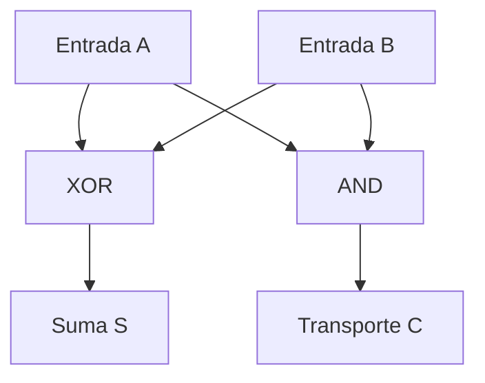

# Compuertas lógicas y circuitos combinacionales

[Recurso anterior](../../unidad-2/10-mapas-de-karnaugh/README.md) · [Índice de la unidad](../README.md) · [Siguiente recurso](../../unidad-3/01-analisis-del-problema/README.md)

## Objetivo

Conectar lógica, tabla y un sumador de un bit.

## Conceptos y explicación

Una compuerta lógica implementa una función sobre señales codificadas. AND, OR y NOT son básicas en la descripción; NAND niega AND, NOR niega OR y XNOR niega XOR. Los circuitos reales tienen retardos y características eléctricas. La tabla ideal representa valores lógicos estables y no esos efectos físicos.

Un circuito combinacional depende de sus entradas actuales; uno secuencial incorpora estado. Un semisumador de dos bits A y B produce suma S=A XOR B y transporte C=A AND B. Cuando ambas entradas son 1, S=0 y C=1: el resultado de dos bits es 10₂.

NAND o NOR permiten construir otras funciones. Por ejemplo, NOT A = NAND(A,A). Eso es una equivalencia lógica; elegir tecnología requiere evaluar implementación física. Un programa Python puede simular la tabla, pero no mide retardos ni valida un dispositivo electrónico.

## Caso resuelto paso a paso



La relación esperada es A+B = 2×C+S usando valores enteros de 0 o 1. Esta comprobación relaciona la aritmética de la lección anterior con la lógica del circuito.

## Código completo

Archivo: [main.py](main.py).

```python
from itertools import product
print("A B C S")
for a, b in product((0, 1), repeat=2):
    suma = a ^ b
    transporte = a & b
    assert a + b == 2 * transporte + suma
    print(a, b, transporte, suma)
```

## Ejecución

Abre una terminal en la carpeta de esta lección. Si aún no tienes Python, sigue la [guía de ambiente](../../docs/ambiente-y-herramientas.md).

Windows (PowerShell):

```powershell
python main.py
```

Ubuntu y macOS:

```bash
python3 main.py
```

### Salida esperada

```text
A B C S
0 0 0 0
0 1 0 1
1 0 0 1
1 1 1 0
```

Compara con [esperado.txt](esperado.txt). Una diferencia de contenido merece revisión; los saltos de línea pueden variar entre sistemas.

## Práctica guiada

Dibuja entradas y salidas. Evalúa XOR y AND. Forma el resultado de dos bits. Comprueba la igualdad aritmética. Explica qué no mide la simulación.

## Errores que conviene detectar

- Usar OR como bit de suma de un semisumador.
- Atribuir a una simulación lógica la verificación de retardos físicos.

## Ejercicio para resolver

Obtén NOT usando NAND y completa la tabla de un sumador completo con entrada adicional Cin. Propón fórmulas para suma y transporte.

<details>
<summary>Solución y razonamiento (abre después de intentarlo)</summary>

NOT A = not(A and A). Para el sumador completo: S = A XOR B XOR Cin; C = (A AND B) OR (Cin AND (A XOR B)). Comprueba las ocho combinaciones con A+B+Cin = 2C+S.

</details>

## Preguntas de comprensión

¿Por qué OR no sirve como suma del semisumador? ¿Qué distingue un circuito con estado? ¿Qué límites tiene una tabla ideal?

## Evidencia de aprendizaje

Entrega tu desarrollo del ejercicio, el razonamiento o prueba de escritorio y al menos un caso límite. Explica cualquier cambio de contrato. Conserva los resultados que permitan comprobar tu conclusión.

[Recurso anterior](../../unidad-2/10-mapas-de-karnaugh/README.md) · [Índice de la unidad](../README.md) · [Siguiente recurso](../../unidad-3/01-analisis-del-problema/README.md)
